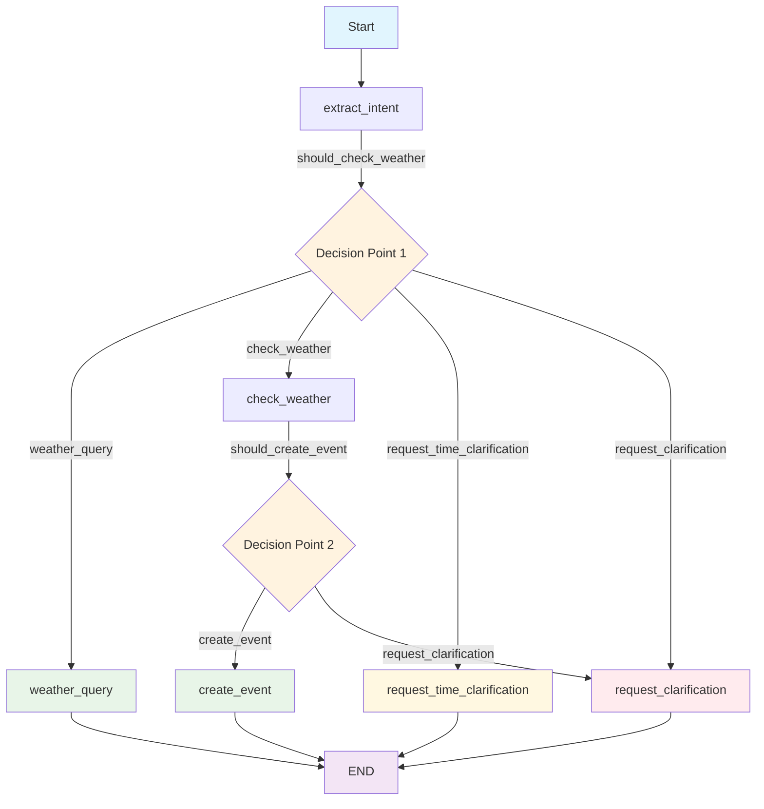

# LangChain & LangGraph Beginner's Guide 🧠🔗

> **Learning Focus**: Understanding how LangChain and LangGraph work together to create intelligent agentic workflows

This guide walks through the `main.py` implementation step-by-step, explaining how **LangChain** and **LangGraph** are used to build a sophisticated AI agent that can make decisions, maintain state, and handle complex conversational flows.

## 📚 What Are LangChain & LangGraph?

### 🔗 **LangChain**
- **Purpose**: Framework for building applications with Large Language Models (LLMs)
- **Key Features**: 
  - Easy LLM integration (Gemini, OpenAI, etc.)
  - Structured output parsing
  - Prompt management
  - Memory and context handling

### 🕸️ **LangGraph** 
- **Purpose**: Extension of LangChain for building **stateful, multi-actor applications**
- **Key Features**:
  - **State management** across conversation turns
  - **Conditional routing** based on data/decisions
  - **Graph-based workflows** with nodes and edges
  - **Agentic behavior** - AI that can plan and execute multi-step tasks

## 🏗️ Architecture Overview

Our AI agent uses this flow:
```
User Input → LangChain (Parse Intent) → LangGraph (Route Decision) → Multiple Paths → Response
```

**Why This Matters**: Instead of a simple "input → output" chatbot, we have an **agent** that can:
- Remember context across messages
- Make decisions based on data (weather)
- Route to different behaviors
- Handle multi-turn conversations

## 📋 Code Walkthrough

### 1. **Data Models with Pydantic** 📊

```python
from pydantic import BaseModel, Field

class IntentExtraction(BaseModel):
    """Structured output for intent extraction from user message"""
    activity: str = Field(description="The activity the user wants to do")
    datetime_str: str = Field(description="Extracted date and time in ISO format")
    location: Optional[str] = Field(description="Location if mentioned", default=None)
    confidence: float = Field(description="Confidence score 0-1", default=0.0)
    is_weather_query: bool = Field(description="True if this is just a weather query", default=False)
    has_specific_time: bool = Field(description="True if user provided specific time", default=False)
```

**🎯 LangChain Concept**: **Structured Output**
- Instead of getting raw text from the LLM, we get **structured data**
- Pydantic models ensure the AI returns data in the exact format we need
- This makes the AI's output **predictable and usable** by our code

### 2. **LangGraph State Management** 🗃️

```python
from typing import TypedDict

@dataclass
class AgentState(TypedDict):
    """State object for LangGraph agent"""
    user_message: str
    telegram_chat_id: int
    intent: Optional[IntentExtraction]
    weather: Optional[WeatherData]
    calendar_event_created: bool
    response_message: str
    needs_clarification: bool
```

**🎯 LangGraph Concept**: **Persistent State**
- The `AgentState` is passed between all nodes in our workflow
- Each node can **read from** and **write to** this shared state
- This allows our agent to **remember** information as it moves through the workflow
- **Key Insight**: This is what makes it "agentic" - it maintains context and builds up information over time

### 3. **LangChain LLM Integration** 🤖

```python
from langchain_google_genai import ChatGoogleGenerativeAI
from langchain.schema import HumanMessage, SystemMessage
from langchain.output_parsers import PydanticOutputParser

class GeminiClient:
    def __init__(self, api_key: str):
        # Initialize the LLM
        self.llm = ChatGoogleGenerativeAI(
            model="gemini-2.0-flash-exp",
            google_api_key=api_key,
            temperature=0.1  # Low temperature for consistent output
        )
        # Set up structured output parsing
        self.parser = PydanticOutputParser(pydantic_object=IntentExtraction)
    
    async def extract_intent(self, user_message: str) -> IntentExtraction:
        """Extract intent and datetime from user message"""
        system_prompt = """You are an AI assistant that extracts scheduling intent...
        {format_instructions}"""
        
        messages = [
            SystemMessage(content=system_prompt.format(
                current_time=datetime.now().isoformat(),
                format_instructions=self.parser.get_format_instructions()
            )),
            HumanMessage(content=user_message)
        ]
        
        response = await self.llm.ainvoke(messages)
        return self.parser.parse(response.content)
```

**🎯 LangChain Concepts Explained**:

1. **LLM Abstraction**: `ChatGoogleGenerativeAI` provides a consistent interface to Gemini
2. **Message Types**: `SystemMessage` (instructions) vs `HumanMessage` (user input)
3. **Output Parsing**: `PydanticOutputParser` automatically converts LLM text to structured objects
4. **Prompt Templates**: `{format_instructions}` dynamically inserts parsing instructions

**Why This Matters**: LangChain handles all the complexity of:
- API calls to Gemini
- Prompt formatting
- Response parsing
- Error handling

### 4. **LangGraph Workflow Nodes** 🔄

Each node is a function that takes state and returns modified state:

```python
async def extract_intent_node(state: AgentState) -> AgentState:
    """Node to extract intent from user message"""
    logger.info("Extracting intent from user message")
    
    gemini_client = GeminiClient(os.getenv("GEMINI_API_KEY"))
    intent = await gemini_client.extract_intent(state["user_message"])
    
    # Modify the state
    state["intent"] = intent
    logger.info(f"Extracted intent: {intent}")
    return state

async def check_weather_node(state: AgentState) -> AgentState:
    """Node to check weather for the planned activity"""
    logger.info("Checking weather forecast")
    
    if not state["intent"]:
        state["weather"] = None
        return state
    
    weather_client = WeatherClient(os.getenv("OPENWEATHER_API_KEY"))
    location = state["intent"].location or "Singapore"
    
    weather = await weather_client.get_weather_forecast(
        state["intent"].datetime_str, 
        location
    )
    
    state["weather"] = weather
    return state
```

**🎯 LangGraph Concepts**:

1. **Nodes as Functions**: Each step in the workflow is a separate function
2. **State Transformation**: Nodes read state, do work, update state, return state
3. **Async Operations**: Nodes can make API calls without blocking
4. **Modularity**: Each node has a single responsibility

### 5. **Conditional Routing Logic** 🛤️

```python
def should_check_weather(state: AgentState) -> str:
    """Router: decide if we should check weather, handle weather query, or request clarification"""
    if state["intent"] and state["intent"].confidence > 0.5 and state["intent"].activity != "unknown":
        if state["intent"].is_weather_query:
            return "weather_query"
        elif not state["intent"].has_specific_time:
            return "request_time_clarification"
        else:
            return "check_weather"
    else:
        return "request_clarification"

def should_create_event(state: AgentState) -> str:
    """Router: decide if we should create calendar event or ask for clarification"""
    if state["weather"] and not state["weather"].is_rainy:
        return "create_event"
    else:
        return "request_clarification"
```

**🎯 LangGraph Concept**: **Conditional Edges**
- These functions examine the current state and **decide which node to go to next**
- This is what makes the agent "intelligent" - it can make decisions based on data
- Different paths through the workflow based on:
  - Intent confidence
  - Weather conditions
  - User preferences

### 6. **Building the LangGraph Workflow** 🏗️

```python
from langgraph.graph import StateGraph, END

def create_agent_workflow() -> StateGraph:
    """Create the LangGraph workflow"""
    
    # Create the graph
    workflow = StateGraph(AgentState)
    
    # Add nodes (the "what to do")
    workflow.add_node("extract_intent", extract_intent_node)
    workflow.add_node("check_weather", check_weather_node)
    workflow.add_node("weather_query", weather_query_node)
    workflow.add_node("create_event", create_calendar_event_node)
    workflow.add_node("request_time_clarification", request_time_clarification_node)
    workflow.add_node("request_clarification", request_clarification_node)
    
    # Set entry point
    workflow.set_entry_point("extract_intent")
    
    # Add conditional edges (the "where to go next")
    workflow.add_conditional_edges(
        "extract_intent",
        should_check_weather,  # This function decides the next step
        {
            "check_weather": "check_weather",
            "weather_query": "weather_query",
            "request_time_clarification": "request_time_clarification",
            "request_clarification": "request_clarification"
        }
    )
    
    workflow.add_conditional_edges(
        "check_weather",
        should_create_event,
        {
            "create_event": "create_event",
            "request_clarification": "request_clarification"
        }
    )
    
    # Add end edges
    workflow.add_edge("create_event", END)
    workflow.add_edge("weather_query", END)
    workflow.add_edge("request_time_clarification", END)
    workflow.add_edge("request_clarification", END)
    
    return workflow.compile()
```

### 📊 **Workflow Visualization**

Here's a Mermaid flowchart that illustrates the LangGraph workflow logic:



**🎯 Flowchart Explanation**:

1. **Entry Point**: Always starts with `extract_intent` to understand user's message
2. **Decision Point 1** (`should_check_weather`): Routes based on intent quality and type
3. **Decision Point 2** (`should_create_event`): Routes based on weather conditions
4. **Green Nodes**: Successful completion paths (weather info, event created)
5. **Yellow/Red Nodes**: Clarification needed (time missing, unclear intent, bad weather)

**🎯 LangGraph Concepts Explained**:

1. **StateGraph**: The main workflow container that manages state
2. **Nodes**: Individual steps that transform state
3. **Edges**: Connections between nodes
4. **Conditional Edges**: Smart routing based on state data
5. **Entry Point**: Where the workflow starts
6. **END**: Where the workflow terminates
7. **Compile**: Converts the graph definition into an executable workflow

### 7. **Multi-turn Conversation State** 💬

```python
class TelegramBot:
    def __init__(self, token: str):
        self.token = token
        self.app = Application.builder().token(token).build()
        self.agent_workflow = create_agent_workflow()  # Our LangGraph workflow
        
        # Store conversation context for multi-turn conversations
        self.conversation_context = {}
    
    async def handle_message(self, update: Update, context: ContextTypes.DEFAULT_TYPE):
        """Handle incoming messages"""
        user_message = update.message.text.strip()
        chat_id = update.effective_chat.id
        
        # Check if this is a response to a clarification request
        if chat_id in self.conversation_context:
            await self.handle_clarification_response(update, user_message, chat_id)
            return
        
        # Create initial state for new conversation
        initial_state = AgentState(
            user_message=user_message,
            telegram_chat_id=chat_id,
            intent=None,
            weather=None,
            calendar_event_created=False,
            response_message="",
            needs_clarification=False
        )
        
        # Run the agent workflow
        final_state = await self.agent_workflow.ainvoke(initial_state)
        
        # Store context if clarification is needed
        if final_state["needs_clarification"]:
            self.conversation_context[chat_id] = {
                "original_intent": final_state["intent"],
                "waiting_for": "clarification",
                "timestamp": time.time()
            }
        
        # Send response back to user
        await update.message.reply_text(final_state["response_message"])
```

**🎯 Key Concepts**:

1. **Workflow Execution**: `await self.agent_workflow.ainvoke(initial_state)`
   - This runs our entire LangGraph workflow
   - State flows through all the nodes
   - Returns the final state with the response

2. **Context Management**: `self.conversation_context`
   - Stores information between messages
   - Enables multi-turn conversations
   - Tracks what the agent is waiting for

3. **State Initialization**: Creating `AgentState` with user input
   - Every conversation starts with a fresh state
   - User message becomes the input to the workflow

## 🎯 Why This Architecture is Powerful

### **1. Separation of Concerns**
- **LangChain**: Handles LLM communication and parsing
- **LangGraph**: Manages workflow logic and state
- **Business Logic**: Weather checking, calendar creation, etc.

### **2. Agentic Behavior**
- The agent can **plan** (decide what to do next)
- The agent can **remember** (maintain state across turns)
- The agent can **adapt** (different paths based on conditions)

### **3. Scalability**
- Easy to add new nodes (new capabilities)
- Easy to modify routing logic (new decision points)
- Easy to extend state (new data to track)

### **4. Testability**
- Each node can be tested independently
- Routing logic is pure functions
- State is explicit and inspectable

## 🔄 Workflow Execution Example

Let's trace through a real example:

**User**: "I want to go running tomorrow at 4pm"

1. **extract_intent_node**:
   - LangChain calls Gemini with structured prompt
   - Returns: `IntentExtraction(activity="running", datetime_str="2024-12-29T16:00:00", confidence=0.95)`
   - State updated with intent

2. **should_check_weather** (router):
   - Checks: confidence > 0.5? ✅
   - Checks: has_specific_time? ✅
   - Decision: → "check_weather"

3. **check_weather_node**:
   - Calls OpenWeatherMap API
   - Returns: `WeatherData(temperature=25, description="light rain", is_rainy=True)`
   - State updated with weather

4. **should_create_event** (router):
   - Checks: is_rainy? ✅ (True)
   - Decision: → "request_clarification"

5. **request_clarification_node**:
   - Creates response asking user about rainy weather
   - Sets `needs_clarification=True`
   - State updated with response

6. **Telegram Bot**:
   - Stores conversation context
   - Sends clarification message to user
   - Waits for user response

**Result**: The agent intelligently detected rain and asked for clarification instead of blindly creating the event!

## 🚀 Key Takeaways for Beginners

### **LangChain Best Practices**:
1. **Use Pydantic models** for structured output
2. **Separate system and human messages** for clear prompts
3. **Use output parsers** to convert text to objects
4. **Handle errors gracefully** with try/catch blocks

### **LangGraph Best Practices**:
1. **Keep nodes focused** - one responsibility per node
2. **Make routing functions pure** - no side effects
3. **Design state carefully** - include all needed data
4. **Use conditional edges** for intelligent routing
5. **Test workflows step by step**

### **Agentic Workflow Principles**:
1. **State is king** - everything flows through state
2. **Decisions drive routing** - use data to choose paths
3. **Context enables conversations** - remember across turns
4. **Modularity enables growth** - easy to add capabilities

## 🎓 Next Steps

To extend this agent, you could:

1. **Add new nodes**: Email sending, database queries, web searches
2. **Enhance routing**: More sophisticated decision logic
3. **Expand state**: User preferences, conversation history
4. **Add memory**: Long-term storage with LangChain memory components
5. **Create sub-graphs**: Break complex workflows into smaller graphs

The combination of LangChain's LLM integration and LangGraph's workflow management creates a powerful foundation for building sophisticated AI agents that can handle complex, multi-step tasks while maintaining context and making intelligent decisions! 🚀 